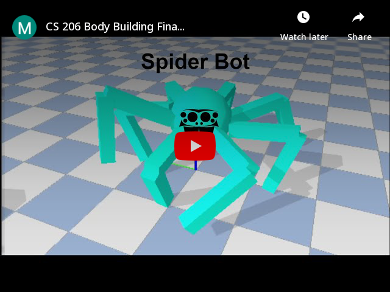

# Evolutionary-Robotic
CS 206 Evolutionary Robotic Assignments 
## About The Project
Developed with python using pytorch engine created an evolutionary machine learning algorithm to train an adaptive robot to learn to walk and adapt their bodies to find an optimal walking cycle. 

##

